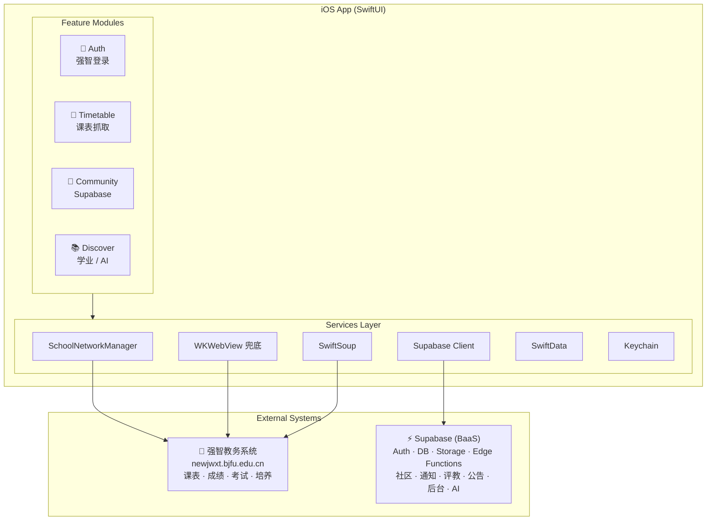

# MyLeafy

<p align="center">
  
  
  
</p>

**MyLeafy** 是面向北京林业大学学生的校园工具 App。以课表为核心，整合全屏 **Leafy AI 工作空间**、**社区**、**学业管理**和**校园服务**，直连北林强智教务系统，并通过 Supabase 承接社区、通知、评教与运营后台。

> 内部代码名、target 和类型命名继续使用 `Leafy`。

---

## ✨ 功能矩阵

| 📅 课表 | 🤖 Leafy AI | 👥 社区 | 📚 学业 | ⚙️ 我的 |
|:---|:---|:---|:---|:---|
| 周视图课表 | DeepSeek 通用问答 | 帖子流与发布 | 成绩查询 | 社区资料管理 |
| 课程详情 sheet | 按需使用本机上下文 | 图片上传 | 考试安排 | 个人内容收藏 |
| 今日课程摘要 | 自备 DeepSeek Key | 评论与点赞 | 教学培养方案 | 共享课表 |
| 单日分享图 | 对话记录本地保存 | 通知与公告 | 自习室查询 | 主题色切换 |
| 日程与提醒 | 页面跳转与提醒动作 | 评教评分 | 校历与作息 | 深色模式 |
| WebView 兜底抓取 | 历史抽屉、成品库与导出 | 邮箱验证绑定 | 空教室占用 | 反馈与支持 |

---

## 🏗 技术架构



### 核心技术选型

| 层 | 技术 |
|:---|:---|
| UI | SwiftUI，iOS 17.0+，部分 iOS 26 Liquid Glass API（`#available` 保护） |
| 本地持久化 | SwiftData（课表缓存、成绩、提醒、收藏） |
| 教务网络 | `URLSession` + 显式 Cookie 管理（非隐式） |
| HTML 解析 | SwiftSoup（课表、成绩、考试、培养方案） |
| 课表兜底 | WKWebView（带 Cookie 复现浏览器路径） |
| 社区后端 | Supabase Auth / Database / Storage / Edge Functions |
| AI 引擎 | DeepSeek API（当前仅开放设备 Keychain 中的自备 Key 直连） |
| 运营后台 | React 18 + Vite + TypeScript |
| CI/CD | GitHub Actions（分支检查、网站构建、Xcode 项目校验） |

---

## 📁 项目结构

```text
leafy/
├── leafy/                    # iOS App 主工程
│   ├── App/                  # 启动、根导航、主题、生命周期
│   ├── Features/             # Auth / Timetable / Community / Discover / Profile
│   │   ├── */Presentation/   # SwiftUI 页面与子视图
│   │   ├── */Application/    # 用例、仓储协议、缓存协调
│   │   └── */Domain/         # 纯计算模型与投影
│   ├── Services/             # SchoolNetworkManager、Supabase、诊断
│   ├── Parsers/              # SwiftSoup HTML 解析器
│   └── Shared/Models/        # 社区 DTO、SwiftData 模型
├── leafyTests/               # 单元测试
├── supabase/                 # Supabase 配置
│   ├── migrations/           # 数据库 schema、RLS、trigger
│   ├── functions/            # Edge Functions（Deno/TypeScript）
│   └── scripts/              # 管理脚本
├── site/                     # 官网 + 运营后台
│   └── src/admin/            # React 后台（/admin）
├── docs/                     # 项目文档中心
└── Config/                   # Xcode 构建配置（本地 xcconfig 不入库）
```

---

## 🚀 快速开始

### 前置条件

- **Xcode** 15+（Swift 5.x，iOS 17.0 SDK）
- **Node.js** 18+（仅构建后台和官网时需要）
- 北京林业大学强智教务账号（用于 App 内登录）

### 构建 iOS App

```bash
git clone https://github.com/<org>/leafy.git
cd leafy

# 创建本地构建配置
cp Config/Leafy.example.xcconfig Config/Leafy.local.xcconfig
# 编辑 Leafy.local.xcconfig，填入 Supabase URL 和 publishable key

# 在 Xcode 中打开项目
open leafy.xcodeproj
# 选择 leafy target，在模拟器或真机上 ⌘R 运行
```

### 部署 Supabase 后端

```bash
# 安装 Supabase CLI 并登录
supabase link --project-ref <your-project-ref>

# 按顺序执行 migration
for f in supabase/migrations/*.sql; do
  supabase db push
done

# 部署 Edge Functions
supabase functions deploy community-bootstrap-user
supabase functions deploy campus-ai-assistant
# ... 其他 functions
```

详细的 Supabase 配置（Anonymous sign-ins、Email provider、SMTP、Storage bucket、RLS）请参考 [Supabase 接入文档](docs/supabase.md)。

### 构建运营后台

```bash
cd site
cp .env.example .env
# 编辑 .env，填入 VITE_SUPABASE_URL 和 VITE_SUPABASE_PUBLISHABLE_KEY
npm install
npm run dev     # 本地调试
npm run build   # 生产构建
```

---

## 📖 文档

| 文档 | 说明 |
|:---|:---|
| [项目总览](docs/overview.md) | 产品定位、已落地能力、数据源边界 |
| [架构说明](docs/architecture.md) | 分层设计、教务直连、SwiftData、Supabase、后台架构 |
| [App 设计](docs/app-design.md) | 页面信息架构、5 个根 Tab、状态与交互 |
| [UI 风格指南](docs/ui-style-guide.md) | 主题色、字体、圆角、间距、卡片、状态展示 |
| [Supabase 接入](docs/supabase.md) | 身份模型、migration 顺序、Edge Functions、配置 |
| [运营后台](docs/admin-console.md) | React 后台配置、模块、安全边界 |
| [贡献规范](docs/contributing.md) | Issue/PR 流程、分支命名、CI |
| [路线图](docs/roadmap.md) | P0-P3 优先级与后续计划 |
| [TestFlight 检查清单](docs/testflight-checklist.md) | 发包前逐项检查 |
| [发布说明](docs/release-notes.md) | App Store / TestFlight 文案 |

---

## 🤝 贡献

欢迎贡献！请先阅读 [贡献规范](docs/contributing.md)。

**基本流程：** 开 Issue 说明问题 → 从 `main` 拉分支 → 提交 PR → GitHub Actions 通过 → 合并。

**分支命名：** `feature/<slug>`、`fix/<slug>`、`docs/<slug>`、`chore/<slug>`

CI 在 PR 和 push 到 `main` 时自动运行：
- 仓库卫生检查（分支命名、敏感文件、密钥格式）
- 网站构建（`site/` 目录 `npm ci && npm run build`）
- Xcode 项目结构校验

---

## 🗺 路线图

当前阶段重点：**稳定核心链路**，准备 TestFlight 分发。

| 优先级 | 重点 |
|:---|:---|
| **P0** | TestFlight 安全检查、隐私合规、配置隔离 |
| **P1** | 课表解析稳定性、错误文案优化、HTMLParser 回归测试 |
| **P2** | 社区运营工具完善、教师名录维护、通知体验优化 |
| **P3** | 帖子收藏、缓存同步、数据安全说明 |

详见 [路线图](docs/roadmap.md)。

---

## 📄 许可证

本项目采用 **[CC BY-NC-SA 4.0](https://creativecommons.org/licenses/by-nc-sa/4.0/)** 许可。

**简单来说：**
- ✅ 个人学习、研究、非商业用途自由使用
- ✅ 可修改和再分发（需署名 + 相同方式共享）
- ❌ **不得用于商业目的**

---

## 📬 联系方式

- **反馈与问题**：通过 App 内「我的 → 支持 → 意见反馈」提交，或在 GitHub 提交 [Issue](../../issues)
- **联系邮箱**：`support@myleafy.space`
