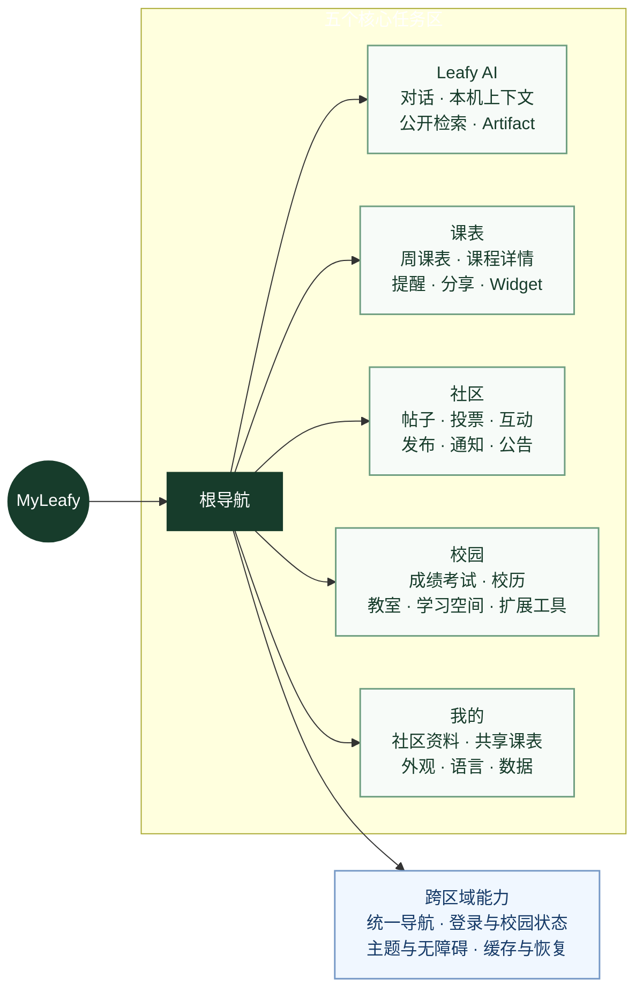

# MyLeafy App 产品设计

本文定义 MyLeafy iOS App 的产品结构、核心流程、页面职责和状态约定。它回答“用户为什么进入这个页面、能完成什么、失败后怎么办”，不重复具体视觉令牌或后端实现。

- 视觉和组件规范：[UI 风格规范](ui-style-guide.md)
- 技术实现与数据流：[架构说明](architecture.md)
- 数据来源与产品边界：[项目总览](overview.md)

MyLeafy 是当前面向北京林业大学学生、以课表为核心的校园工具 App。设计重点是快速打开、快速确认今天安排，同时在根导航中提供 Leafy AI 对话入口；校园数据是 Leafy 的本机能力，而不是 AI 可回答问题的边界。

## 1. 产品目标

MyLeafy 面向需要频繁处理课表、学业信息和校园事务的高校学生。核心目标是：

- 让用户在数秒内确认“今天上什么课、在哪里、接下来做什么”。
- 把成绩、考试、培养方案、教室、学习记录等分散工具组织成可理解的学业空间。
- 让同学间的信息交流、课表共享和结构化评价具有清晰边界。
- 让 Leafy AI 基于用户允许的数据进行整理和解释，而不是成为不可控的自动执行层。
- 在学校服务不稳定时，尽可能保留最近成功数据并给出明确恢复方式。

## 2. 目标用户与主要任务

| 用户场景 | 用户目标 | 产品响应 |
|---|---|---|
| 上课前 | 快速确认课程、地点和时间 | 默认课表、当前时间定位、课程详情与 Widget |
| 选课或复盘 | 查看成绩、考试、学分和培养要求 | 教学培养领域内的结构化工具 |
| 安排时间 | 整合课程、考试、倒计时和个人计划 | 时间范围、日程报告与提醒 |
| 找学习地点 | 查询空教室或常用空间 | 空闲教室、指定教室和收藏 |
| 管理学习 | 整理资料、任务、记录和学习项目 | 学习空间与本地记录 |
| 校园交流 | 阅读、发布、互动和接收通知 | 社区 Feed、发布、详情与通知中心 |
| 与同学协作 | 分享自己的课表或查看好友课表 | 主动发布的课表数据与只读授权 |
| 理解复杂信息 | 汇总学业数据、生成计划或报告 | Leafy AI 对话与 Artifact |

## 3. 信息架构

### 3.1 根导航

根 Tab 的逻辑顺序为：

1. `Leafy`：根 Tab 内的 AI 对话页面，承接通用问答、历史对话与 Artifact。
2. `课表`：最高频时间入口，应用默认页。
3. `社区`：校园内容、互动、通知与发布。
4. `校园`：按领域组织的学习和校园工具。
5. `我的`：个人资料、内容、共享、外观、数据与支持。

课表虽然不是视觉顺序的第一个 Tab，但它是默认选中项。社区由校园能力决定是否显示；隐藏社区时，其通知订阅与相关入口也应同步停止或降级。

### 3.2 校园一级领域

校园页使用横向可滚动的一级领域导航。当前领域包括：

- 教学培养
- 时间日程
- 空闲教室
- 学习空间
- 体育相关
- 职业规划
- 考研信息
- 评价相关
- 医疗事项
- 周末去哪

不同校园只显示其支持的领域。例如自定义校园可以使用本地学习和日程工具，但不会默认显示依赖北林接口的空教室或校园专属工具。

一级领域是任务分组，不是后端数据表映射。新增功能应先判断属于哪个既有领域，避免继续扩张根 Tab。

## 4. 全局启动与身份流程

### 4.1 首次进入

1. App 初始化本地模型、外观与校园上下文。
2. 没有可恢复身份时进入登录页。
3. 北京林业大学入口使用学号、教务密码和教务验证码；通用校园入口使用 Supabase 邮箱账号流程。
4. 身份建立后进入根 Tab，默认显示课表。
5. 北京林业大学用户进入需要云端能力的页面时，再恢复或创建独立的 Supabase 业务会话。

学校登录和社区初始化必须解耦。学校登录成功不代表 Supabase 一定可用，Supabase 暂时失败也不应把用户踢回学校登录页。

### 4.2 登录页

北京林业大学入口的必需字段：

- 学号。
- 密码。
- 验证码。

通用校园入口采用邮箱、密码与邮件验证码完成注册或登录；不显示学校验证码，也不能假装已经验证某个学校教务身份。

共同交互要求：

- 验证码可刷新，并保留已输入的非敏感字段。
- 密码支持显隐切换。
- 提交中禁用重复操作并显示明确进度。
- 键盘与焦点顺序符合表单流程。
- 登录失败区分验证码错误、凭据错误、网络错误和未知学校页面。
- 不在 UI、日志和剪贴板中暴露编码结果、Cookie 或原始密码。

### 4.3 会话失效

- 学校会话失效：保留安全的本地缓存，要求重新登录后再刷新。
- Supabase 会话失效：尝试恢复业务会话；失败时只禁用相关远程功能。
- 管理员会话与普通 App 用户无关，不在 iOS 中复用。

## 5. 课表

课表是最高频页面，应优先保证可读性、时间定位和失败恢复。

### 5.1 页面组成

- 当前学期和周次上下文。
- 周次切换、刷新和时间范围入口。
- 按日期和节次组织的课程网格。
- 课程、提醒、考试或倒计时等不同类型的时间块。
- 当前时间或当天位置提示。
- 课程详情、编辑备注、提醒或相关操作的 sheet。

### 5.2 课程块

课程块至少表达：

- 课程名称。
- 教室或地点。
- 必要时显示教师、节次和状态。

同一时段出现多个课程时应并排或以明确方式解决冲突，不能互相覆盖。颜色由稳定课程名称映射和当前主题共同决定，避免每次刷新随机变化。

### 5.3 年度视图关系

“年度视图”入口位于“校园 → 时间日程”，并复用课表的学期和日历配置。它将周课表扩展为更完整的年度时间视角，可承接：

- 月/周范围浏览。
- 课程、考试、倒计时和提醒的聚合。
- 指定日期详情。
- 从年度视图返回时间日程或继续进入相关校园工具。

它不应复制完整课表编辑逻辑，而应复用统一的投影和详情入口。

### 5.4 刷新与缓存

- 首次无数据：展示阻塞式但可理解的加载状态。
- 已有缓存刷新：继续显示旧数据，并使用局部刷新指示。
- 学校网络失败：保留缓存并提示稍后重试。
- 会话失效：提示重新登录。
- 解析失败：说明学校页面可能变化，不把“无课”误判为解析成功。
- 当前周无课：显示真实空状态，可切换其他周。

### 5.5 分享与扩展

- 分享图应只包含用户已确认可公开的课程信息。
- Widget 使用主 App 发布的稳定展示数据，并通过深链回到具体页面。
- 共享课表必须由用户首次主动发布；后续更新只影响已发布数据。
- 邀请接受前应说明共享方向、可见字段和撤销方式。

## 6. Leafy AI

Leafy AI 是辅助入口，不是替代所有功能的万能聊天框。

### 6.1 对话结构

- Leafy 保持在根 `TabView` 内，底部校园 Tab Bar 始终可见；输入栏通过系统安全区停靠在 Tab Bar 上方并跟随键盘。
- 顶部依次提供历史记录、设置、Flash/Pro 原生胶囊模型选择和新建对话；历史与设置均使用原生 Sheet，不使用侧滑抽屉。
- 空状态说明能力、数据来源和限制。
- 输入区支持问题和有限的建议入口。
- 消息列表只展示轻量内容，复杂结果用 Artifact 卡片承接。
- 历史对话可本地浏览和管理。
- AI 回复下方依次提供复制、重新生成和线性回退；长按用户消息可重新编辑，重新发送后截断该消息之后的旧分支。
- Agent 执行期间展示可核验的搜索、读取和整理进度，完成后折叠保留；不展示模型原始思维链。
- 设置入口负责免费/订阅额度、自备 API Key、联网研究和数据使用说明；Leafy AI 服务固定显示 Flash，自备 Key 时顶部胶囊可切换 Flash/Pro。

### 6.2 上下文原则

- 默认只使用回答问题所必需的数据。
- 明确区分本机学业数据、公开信息和模型推断。
- 不把成绩、学号、课程备注等私密上下文写入社区。
- 用户删除 API Key 后，历史内容仍保留，并可改回 Leafy AI 免费或订阅额度继续使用。
- 默认使用 Leafy AI Flash：未订阅每日免费 10 次；周订阅每个 Apple 订阅周期 120 次且每日最多 40 次。
- 自备 DeepSeek API Key 是备选模式，Key 保存在设备 Keychain；只有该模式开放 Flash/Pro 切换，模型选择只影响后续请求。
- 联网研究默认开启，并可在设置中关闭。iOS 端使用动态收束的单工具 Agent Loop：校园政策优先检索北林官方 CMS，官方资料不足或明确涉及校外内容时使用 DuckDuckGo Lite，再按搜索结果 ID 读取网页、PDF 或 Excel。10 轮、15 次搜索、20 个网页、4 个 PDF 和 4 个 Excel 都是安全上限而非目标，资料足够时立即结束。
- 联网规划输入只包含当前问题和有限的近期对话，不携带整份本机校园上下文。搜索候选先按问题关键词与校园同义词筛选；只有成功读取且被最终回答引用的来源才进入来源卡。
- Tool Gateway 只接收搜索词、搜索结果 receipt 和 Supabase JWT，不接收用户自备 DeepSeek Key；Leafy AI 服务请求经 `campus-ai-assistant` 发送，自备 Key 模式由 iOS 直连 DeepSeek。Gateway 使用记录只保留用户 ID、工具、状态、耗时、结果数和时间。
- 免费搜索是 best-effort 能力，可能遇到限流、验证码、超时或页面结构变化。失败必须保留已取得来源，并明确标记未联网验证的范围，不能伪造来源或静默切换随机公共搜索实例。
- 公开 HTML、带文本层的 PDF 和 XLSX 表格可被分析。PDF 最大 10 MB、读取前 100 页；Excel 最大 8 MB，并限制工作表、行列和文本总量。扫描 PDF 不做 OCR，旧版 XLS 与 DOC/DOCX/PPT/PPTX 只作为可打开附件展示。
- Key 配置页说明创建步骤，并提供 DeepSeek 官方 API Keys 页面链接；外部页面由系统浏览器打开。

### 6.3 Artifact

适合生成 Artifact 的结果包括计划、报告、清单、表格和结构化流程。交互规则：

1. 聊天中展示标题、摘要和状态卡片。
2. 点击进入独立阅读页。
3. 阅读页负责完整 Markdown、公式、图表或代码展示。
4. 导出前明确文件格式和可能包含的个人数据。
5. 生成失败保留原始对话，并提供重试或查看错误摘要。

聊天列表只展示轻量 SwiftUI 卡片，完整 Markdown、Mermaid、KaTeX 和代码渲染仅在阅读页加载。Artifact 继续保存在消息 metadata 中，并可从聊天卡片打开及导出为静态 HTML、Markdown 或纯文本。

### 6.4 动作边界

允许：

- 打开指定课表或校园页面。
- 基于现有信息准备提醒或建议。
- 生成用户可检查的计划和报告。

不允许默认执行：

- 修改学校成绩、原始课表或培养数据。
- 代替用户发布、删除社区内容。
- 绕过页面确认发送或共享个人数据。
- 将模型推断表述为学校官方结论。

## 7. 社区

### 7.1 Feed

社区首页负责发现内容和进入主要动作：

- 全部或分类内容筛选。
- 置顶内容与普通内容的清晰区分。
- 帖子、图片、投票和互动摘要。
- 通知入口、未读提示和发布入口。
- 刷新、分页、空状态和失败重试。

Feed 排序以服务端返回为准，客户端不应用一套不同的置顶规则二次重排。

### 7.2 发布

- 未完成社区资料时，先引导完善必要字段。
- 发布前校验文本、图片数量和内容类型。
- 图片先进行尺寸和格式处理，再上传到用户命名空间。
- 上传与发帖是可恢复的多阶段操作，失败时不要让用户误以为已经发布。
- 发布成功后返回 Feed 或详情，并更新相关列表。

### 7.3 帖子详情与互动

- 展示完整内容、作者、时间、分类和互动状态。
- 一级评论按稳定顺序展示。
- 点赞、评论和投票需要明确进行中状态，避免重复提交。
- 用户只能删除自己有权删除的内容；下架内容使用统一不可用状态。
- 分享链接进入 App 时验证帖子 ID，帖子不可见时显示安全错误页。

### 7.4 通知与公告

- 未读数在社区 Tab 和通知入口保持一致。
- 通知点击后定位到对应内容；内容已删除时说明原因。
- 公告与互动通知在视觉和语义上区分。
- 静音设置只改变通知呈现，不应删除历史数据。

## 8. 校园

校园页的核心设计是“领域 → 工具 → 详情”，每个领域提供简短说明和少量高价值入口。

### 8.1 教学培养

包含成绩、成绩分析、考试、荣誉记录、综合测评、教学计划和培养方案等。页面需要明确数据学期、更新时间和数据来源；计算结果必须说明口径，不能把推导值伪装成学校官方排名。

### 8.2 时间日程

整合考试、校历、日程报告和倒计时。学校日历、本地日程和用户自定义内容应使用不同来源标识，并在修改权限上保持差异。

### 8.3 空闲教室

支持按楼宇、日期和节次查询，以及指定教室占用查看。查询条件应在返回后保持可见，失败状态要区分无结果与学校请求失败。

校园热力图不内置全学期占用数据。用户在页面内重新登录教务并按需更新所选日期和节次，每个校园账号只保留最近一次成功更新的数据。

### 8.4 学习空间

围绕学习项目组织资料、任务和记录。删除或移动项目内容时必须预览影响范围，避免把“删除项目”和“删除所有资料”混为一个动作。

### 8.5 其他领域

体育、职业、考研、评价、医疗和周末出行具有不同数据来源。它们必须遵循同一规则：

- 只有数据来源和维护责任明确时才开放。
- 校园专属入口受 capability 控制。
- 外部信息标注更新时间和来源。
- 评价只展示经后端授权可读的数据。

## 9. 我的

“我的”负责个人身份、用户产生的内容、共享关系、设置和支持，不承担校园工具导航。

推荐结构：

1. 个人资料：头像、昵称、校园身份摘要和邮箱状态。
2. 个人内容：帖子、评论、点赞、投票等。
3. 功能：共享课表、缓存与同步、课表背景等。
4. 外观与偏好：主题色、外观、显示密度、语言。
5. 支持：反馈、联系、数据说明和关于。
6. 退出：单独的危险操作区。

退出登录前说明影响范围。学校会话、Supabase 会话、可恢复缓存和用户本地数据是否清理，应根据当前实现明确描述，不使用笼统的“清除所有数据”。

## 10. 全局状态模型

每个依赖数据的页面都必须定义：

| 状态 | 展示要求 | 可用动作 |
|---|---|---|
| Initial | 不闪烁错误或伪空状态 | 开始加载 |
| Loading | 说明正在加载什么；已有数据时尽量非阻塞 | 允许取消的操作提供取消 |
| Content | 显示数据来源、必要时间范围和刷新状态 | 进入详情、编辑或刷新 |
| Empty | 解释“为什么为空”，不能与失败混淆 | 创建、导入、切换范围或刷新 |
| Error | 用户可理解的原因和安全摘要 | 重试、重新登录或返回 |
| Unauthenticated | 明确是学校会话还是业务会话 | 重新认证 |
| Partial | 保留成功部分，标明缺失部分 | 单独重试失败来源 |

同一个页面不得同时用 alert、toast 和内嵌错误重复表达一次失败。

## 11. 导航与深链

- 根级页面由 `TabView` 承载。
- 层级详情优先使用 `NavigationStack` / `NavigationLink`。
- 短时编辑、筛选和轻量详情使用 sheet。
- 需要连续上下文或完整阅读的内容使用 push 或全屏页面。
- 危险操作使用确认对话框，并写清对象和后果。
- `leafy://` 与 `myleafy.space` 深链只能打开白名单路由。
- 深链目标不可用时提供退路，不留在空白页。

## 12. 文案与数据表达

- 优先写用户可执行的信息，例如“学校登录已过期，请重新登录”，而不是“请求失败”。
- 明确“学校数据”“MyLeafy 数据”“本机数据”的来源。
- 时间必须带必要的学期、日期、周次或时区上下文。
- 统计和评分显示样本量，低样本不使用过度确定的描述。
- AI 生成内容、运营公告和用户内容在身份上清楚区分。
- 不把内部类名、表名、Cookie、request body 或文件路径直接暴露给普通用户。

## 13. 产品验收标准

新功能进入主路径前，至少满足：

- 用户目标、入口和返回路径明确。
- 数据来源、权威关系和隐私范围明确。
- Loading、Empty、Error、Unauthenticated 和恢复路径完整。
- 深色模式、主题色、显示密度和多语言下可读。
- 小屏、长文本和较大显示尺寸下不截断关键操作。
- 所有交互元素具备可理解的可访问性标签。
- 依赖学校或后端的功能有本地或降级策略。
- 相关产品、架构和接入文档同步更新。
