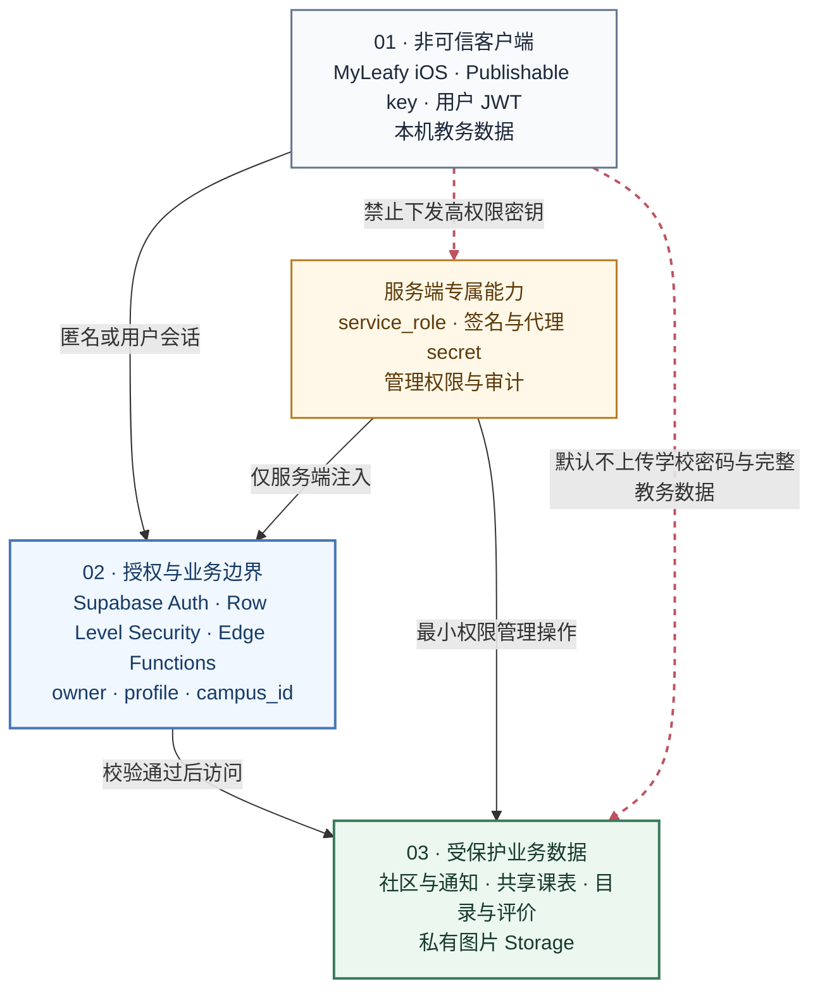

# MyLeafy Supabase 接入

本文说明 MyLeafy 如何使用 Supabase，以及开发环境如何建立可工作的 Auth、Database、Storage 与 Edge Functions。它面向贡献者和自建环境，不包含生产账号、真实密钥或私有运营流程。

> Supabase 承载 MyLeafy 业务数据，不替代学校教务登录，也不是学校课表、成绩和考试数据的权威来源。

## 1. 系统边界



| 组件 | 使用的凭据 | 允许的操作 |
|---|---|---|
| iOS App | publishable key + 普通 Auth 会话 | 受 RLS 约束的用户数据、公开目录、signed URL 和允许的函数 |
| Cloudflare 管理代理 | 服务端环境变量 + 管理会话 | 转发经过 Origin/CSRF 检查的管理请求 |
| Edge Functions | 服务端 secrets | 身份绑定、跨表事务、受控管理操作和审计 |
| 数据库 | PostgreSQL roles / RLS | 执行最终数据访问策略 |

`service_role` 不得出现在 iOS bundle、网站前端、公开 `.env`、截图、日志或 Git 历史中。

## 2. 身份模型

### 2.1 学校身份与 Supabase 身份

MyLeafy 同时维护两个独立身份：

- 学校身份：由目标学校教务系统验证，用于读取用户授权的教务数据。
- Supabase 身份：由 Supabase Auth 管理，用于 MyLeafy 社区、共享、通知和评价业务。

当前社区初始化流程：

1. 用户先在 iOS App 完成学校登录。
2. App 创建或恢复匿名 Supabase Auth 会话。
3. App 调用 `community-bootstrap-user`，传递当前校园和已登录教务标识。
4. Edge Function 使用 `auth.uid()` 建立或恢复 profile 与 auth link。
5. 后续客户端请求依赖 profile 归属、校园范围和 RLS。

`(campus_id, edu_id)` 唯一确定长期 profile。相同教务身份在新装、重装或新设备上建立新的匿名 Auth 会话时，会自动链接并返回原 profile；同一设备切换教务身份时，只移动当前 Auth link，不改写或删除任一 profile 及其内容。并发首次登录由事务级 advisory lock 和 profile 唯一索引保证只创建一个 profile。

这一设计减少了额外注册步骤，但有明确限制：教务标识由已修改的客户端提交时，服务端无法独立证明它一定来自真实学校登录。普通社区能力通过 RLS 和业务限制降低风险；如果未来出现高价值身份权益，必须把学校验证迁移到可信服务端。

### 2.2 Profile 与 Auth link

身份相关数据遵循以下原则：

- `auth.users` 是 Supabase 会话主体。
- `profiles` 是独立于单个 Auth 用户生命周期的长期业务身份，也是帖子、评论、图片和资料的稳定 owner。
- `profile_auth_links` 允许多个设备 Auth 会话映射同一 profile，但一个 Auth 会话最多映射一个 profile。
- `(campus_id, edu_id)` 在业务范围内唯一。
- 普通客户端不能任意修改自己的教务标识或校园作用域。
- 昵称是参与社区互动的最小资料；头像、专业和年级等字段按产品规则可选。

### 2.3 北京林业大学邮箱绑定

北京林业大学社区账号可绑定已验证邮箱。该邮箱只用于服务异常和重要消息通知，不参与登录、换设备继承或社区恢复；北林始终使用学号、教务密码和教务验证码，社区 profile 由当前教务身份自动继承。注意：

- 必须在 Supabase Auth 中允许所需的 manual linking 行为。
- 验证码只发送到待绑定的新邮箱。
- `bound_email` 只能写入已经验证的邮箱；待验证地址单独保存，不能视为有效通知地址或北林登录凭据。
- 邮件模板保存在 `supabase/templates/`，托管项目不会自动读取本地模板，需在目标项目中同步配置。
- 邮件正文不得泄露 token hash、内部回调参数或管理员信息。

本地模板验证脚本位于 `supabase/tests/check-email-change-otp-template.sh`。

### 2.4 通用校园账号

不接入学校教务认证的通用校园入口使用独立的 Supabase 邮箱账号流程，包括注册、邮件验证码和邮箱密码登录。它与北京林业大学的“社区通知邮箱绑定”不是同一产品语义：

- 通用校园邮箱是 App 入口账号。
- 北林绑定邮箱只是已登录用户的通知联系方式。
- 两种模式由校园身份与 capability 决定，UI 和服务不得互相降级或混用。
- 通用校园账号不应被描述为学校官方身份，除非未来增加可信的学校验证机制。

## 3. 数据域

数据库通过 migration 演进。不要把以下列表当作完整 schema，而应把 `supabase/migrations/` 与 `supabase/schema-ledger.md` 作为事实来源。

### 3.1 校园与运行配置

- 校园目录、校园 capability 与访问范围。
- 当前学期、开始日期、支持周数、研究生学期代码和结构化校历事件。
- 后端能力版本与客户端兼容信息。
- 学校/校园申请和相关运营状态。

所有多校园业务表都应显式携带 `campus_id`，RLS 和服务端函数必须验证校园范围，不能依赖客户端查询条件。

### 3.2 社区

- profiles 与身份映射。
- posts、comments、reactions、polls 和 favorites。
- 内容分类、置顶、软删除与 Feed RPC。
- notifications、announcements、feedback 和静音偏好。
- 私有社区图片及其对象路径。

核心规则：

- 发帖和互动前满足 profile 完整度要求。
- 用户只能修改自己拥有且状态允许的内容。
- 内容删除优先使用软删除或受控函数，避免破坏通知、审计和引用。
- 置顶和 Feed 顺序由服务端统一计算。
- 发布频率、图片数量和字段长度由数据库或函数再次校验。

### 3.3 评价与目录

- 教师、课程、菜品等可评价目录。
- 用户评分和按维度聚合的统计。
- 缺失目录建议与后台审核。

普通用户只能读取允许发布的目录，并新增或更新自己的评分。评分范围、唯一性和聚合逻辑由数据库约束或 trigger 保证，不能只依赖客户端控件。

目录型数据需要记录来源与维护责任。仓库提供导入模板，但不附带对真实数据完整性的保证。

### 3.4 共享课表

- 用户主动发布的学期课表数据。
- 只保存共享所需最小字段：课程名、教师、地点、周次、节次、学期与发布时间等。
- 邀请码保存 hash，明文只在生成端短暂展示。
- 邀请限时且单次接受。
- 分享关系为单向只读，双方均有相应退出方式。

本地 SwiftData 课表仍是个人数据的权威副本。不得把成绩、考试结果、课程备注、提醒或其他私密字段加入共享课表数据。

### 3.5 AI 与额度

- Leafy AI 默认通过 `campus-ai-assistant` 使用固定 Flash；免费额度为北京时间每日 10 次。
- 免费额度按 Supabase Auth 用户计数，不要求 App Store 安装记录；Xcode 或 Simulator 缺少有效 AppTransaction 时仍可使用免费额度。
- `com.isaachuo.leafy.ai.weekly.v2` 周订阅按 Apple 实际周期提供 120 次，同时北京时间每日最多 40 次；旧商品不再授予权益。
- 订阅额度只接受服务端验证成功的 Apple 订阅交易 JWS，客户端提交的交易 ID 或 App Transaction ID 不能单独授予权益。
- `private` 额度函数通过仅授予 `service_role` 的公开 RPC 包装层供 Edge Function 调用，不向 `anon` 或 `authenticated` 开放。实现与排查见[Leafy AI 免费额度鉴权](leafy-ai-quota-authentication.md)。
- 自备 DeepSeek API Key 是可选直连模式，Pro 仅在该模式开放。
- 自备 API Key 不存入 Supabase。
- AI 请求日志应最小化，不长期保存完整个人学业上下文。

### 3.6 运营与审计

- 管理员账号、角色、会话与登录尝试。
- 管理动作审计、请求 ID、结果和持续时间。
- 受控搜索和导出。
- 公告、内容状态、目录和运行配置管理。

普通 App RLS 与管理员授权是两套边界。管理员不能通过客户端普通 API 自动获得服务端权限。

## 4. RLS 设计原则

每张暴露给 Data API 的业务表都需要明确回答：谁可以读取、谁可以创建、谁可以修改、谁可以删除。

### 4.1 所有权

- 所有权优先关联 profile 或稳定业务主体，而不是信任客户端提交的任意 user ID。
- policy 中从 `auth.uid()` 推导当前 profile。
- 更新时同时检查旧行和新行，防止用户通过更新所有者字段接管记录。

### 4.2 校园隔离

- 查询、RPC 和 Edge Function 同时验证 `campus_id`。
- 客户端筛选只改善体验，不构成授权。
- 跨校园管理员必须拥有显式范围，不能默认读取所有校园。

### 4.3 公开读取

公开目录或分享页面只暴露确实可公开的字段。即使一张表允许匿名读取，也应通过 view、RPC 或字段白名单避免返回邮箱、学号、内部状态和审计字段。

### 4.4 函数安全

使用 `security definer` 时必须：

- 固定安全的 `search_path`。
- 校验调用者和参数。
- 只授予必要角色执行权限。
- 不返回服务端密钥或内部异常详情。
- 为高风险写操作记录审计。

## 5. Storage

社区图片使用私有 bucket，例如 `community-images`：

- 对象路径按用户或 profile 命名空间隔离。
- 上传前由客户端进行大小、格式和尺寸处理；服务端策略仍限制路径与权限。
- 读取通过 signed URL 或受控函数。
- 删除内容时考虑对象清理、软删除和审计之间的关系。
- 不使用可预测的公开 URL 暴露私有图片。

头像、帖子图片和其他资源应使用独立路径约定，避免一个功能能覆盖另一个功能的对象。

## 6. Edge Functions

当前 `supabase/functions/` 的主要函数组：

| 领域 | 函数 |
|---|---|
| 社区初始化与 Feed | `community-bootstrap-user`、`community-feed` |
| 校园服务 | `campus-request`、`campus-weather` |
| Leafy AI 免费与订阅服务 | `campus-ai-assistant`、`campus-ai-entitlement`、`app-store-server-notifications` |
| 分享 | `share-preview` |
| 管理认证 | `admin-login`、`admin-me`、`admin-logout` |
| 管理业务 | `admin-community`、`admin-export`、公告相关函数 |
| 平台通知 | `app-store-server-notifications` |

共享代码位于 `_shared/`，负责权限、CSV、安全响应和 AI 计费等跨函数逻辑。

函数约定：

- 验证 `Authorization`，需要管理权限的函数还要验证代理边界。
- 对输入做类型、长度、枚举和校园范围检查。
- 返回稳定错误代码和安全消息，不把数据库堆栈直接返回客户端。
- CORS 只开放真实需要的来源和方法。
- 可重试请求应考虑幂等性。
- 高权限操作携带 request ID 并写入审计。

## 7. 本地环境

### 7.1 前置条件

- Supabase CLI。
- Docker（运行本地 Supabase stack 时需要）。
- Deno（独立检查 Edge Functions 时推荐）。
- Xcode 和 Node.js（分别用于 iOS 与管理前端）。

### 7.2 启动本地 Supabase

```bash
supabase start
supabase db reset
supabase status
```

`db reset` 会从头重放 migration，并执行配置中的 seed。它会清空本地数据库，不要对需要保留的数据环境使用。

### 7.3 iOS 配置

复制模板：

```bash
cp Config/Leafy.example.xcconfig Config/Leafy.local.xcconfig
```

配置项：

```text
SUPABASE_URL = https:/$()/your-project-ref.supabase.co
SUPABASE_PUBLISHABLE_KEY = sb_publishable_xxx
SUPABASE_COMMUNITY_BOOTSTRAP_FUNCTION = community-bootstrap-user
SUPABASE_COMMUNITY_FEED_FUNCTION = community-feed
SUPABASE_WEATHER_FUNCTION = campus-weather
SUPABASE_CAMPUS_AI_FUNCTION = campus-ai-assistant
SUPABASE_CAMPUS_AI_TOOLS_FUNCTION = campus-ai-tools
SUPABASE_COMMUNITY_EDGE_REGION = ap-northeast-1
SUPABASE_COMMUNITY_API_BASE_URL =
```

xcconfig 中 URL 的 `https:/$()/` 写法用于避免 `//` 被当作注释。`Leafy.local.xcconfig` 只能保存在本地或安全 CI 环境。

`SupabaseConfig.load()` 会拒绝空值和模板占位值。配置缺失时，依赖 Supabase 的功能应显示不可用状态，不应导致不相关页面崩溃。

### 7.4 部署到自建项目

```bash
supabase login
supabase link --project-ref <project-ref>
supabase db push

supabase functions deploy community-bootstrap-user
supabase functions deploy community-feed
supabase functions deploy campus-weather
supabase functions deploy campus-ai-assistant
```

只部署你实际配置和需要的函数。管理函数还依赖额外的服务端 secrets 和 Cloudflare 代理，见[运营后台](admin-console.md)。

## 8. Migration 管理

`supabase/migrations/` 是 schema 变更的唯一提交入口。要求：

- 文件名使用递增时间戳和清晰名称。
- 新 migration 在空数据库和已有数据库上都可前向执行。
- 不修改已经部署过的历史 migration 来“修正”生产状态；新增补偿 migration。
- 大规模数据回填与 schema 变更分阶段进行。
- 新表同步定义约束、索引、RLS、grants 和必要注释。
- 删除列、函数或 action 前先提供兼容窗口。

`supabase/schema-ledger.md` 记录关键 schema 不变量和迁移顺序。任何文件名调整必须同步更新 ledger、测试和引用文档。

## 9. 学期运行配置

`semester_runtime_configs` 允许在不发布新 App 的情况下切换：

- `semester_id`
- `semester_start_date`
- `supported_weeks`
- `graduate_timetable_term_code`
- 结构化 `calendar_events`
- `is_active`

约束：

- 同一时刻只有一个 active 学期配置。
- 可提前创建下学期配置，但保持 inactive。
- 北京林业大学课表固定呈现 20 周容器，`supported_weeks` 必须保持为 `20`；课程实际上课周次只服从教务响应。
- 学期结束和寒暑假起止日期必须来自结构化 `calendar_events`，不能用 20 周容器反推；`academic_category` 支持 `public_holiday`、`important_date`、`semester_end`、`winter_break` 和 `summer_break`。
- 为兼容已发布客户端，学期事件继续使用旧客户端可解码的 `kind`，更细的学业语义放在可选 `academic_category` 中。
- 激活前必须从学校真实页面确认所有参数，不能根据年份猜测。
- App 回退顺序为远程 active 配置、最近成功缓存、内置默认配置。
- 同一学期远程配置或课表刷新失败不能清空本地课表；学期配置成功切换后，旧课程不能映射到新学期日期。
- 本科使用 `semester_id`，研究生使用 `graduate_timetable_term_code` 查询当前 active 学期；正常换学期不需要发布 App 版本。

建议通过经过权限控制的后台 action 原子切换 active 配置，避免手工 SQL 产生短暂的多 active 状态。

## 10. 目录数据导入

仓库包含：

- `supabase/teacher_import_template.csv`
- `supabase/course_import_template.csv`

导入前：

1. 确认数据来源和使用授权。
2. 规范化名称、学院/单位、分类与学分。
3. 按业务唯一键去重。
4. 在非生产环境检查行数和搜索结果。
5. 通过后台或受控脚本导入，并保留来源说明。

不要把抓取到的个人联系方式、未经授权的评价文本或敏感学校字段混入目录。

## 11. 邮件配置

托管环境需要配置可靠的 SMTP 提供商和经过验证的发信域名。基本要求：

- SPF、DKIM 和必要的 DNS 验证正确。
- 发件地址与产品域名一致。
- Auth 邮件模板与仓库模板同步。
- 验证码邮件只包含完成验证所需的信息。
- 在多个常见邮箱服务商上检查投递、时延和垃圾邮件判定。
- 限制重发频率，只有最新验证码有效。

SMTP 密码、Management API token 和 DNS 凭据只能存放在目标平台 secrets 中。

## 12. 测试与验证

### 数据库

```bash
supabase db reset
supabase test db
bash supabase/tests/verify_admin_security_runtime_migration.sh
```

数据库测试至少覆盖：

- migration 可重放。
- 普通用户的允许和拒绝路径。
- 跨用户、跨校园访问被拒绝。
- 唯一性、范围和状态约束。
- 关键 RPC 的返回契约。

### Edge Functions

```bash
deno check supabase/functions/community-bootstrap-user/index.ts
deno check supabase/functions/community-feed/index.ts
deno check supabase/functions/admin-community/index.ts
```

对权限、CSV 和管理 action 使用仓库中的 Deno 测试与契约测试。测试数据不得包含真实学生账号、生产 token 或生产数据库导出。

### 客户端联调顺序

1. 启用所需 Auth provider。
2. 从头重放 migration。
3. 创建私有 Storage bucket 和对应 policy。
4. 部署 `community-bootstrap-user` 与当前客户端使用的函数。
5. 配置 iOS publishable URL/key。
6. 完成学校登录后进入社区，确认 profile 和 auth link 建立。
7. 测试资料、发帖、图片、评论、互动、通知和退出恢复。
8. 测试跨用户不可写、跨校园不可见和软删除状态。
9. 再按需验证评价、共享课表、AI 与管理能力。

## 13. 常见故障

| 现象 | 优先检查 |
|---|---|
| App 提示缺少配置 | xcconfig 是否加入 target、键名是否正确、占位值是否仍存在 |
| 匿名登录失败 | Auth 是否启用 anonymous sign-in、URL/key 是否属于同一项目 |
| profile 无法创建 | Function 是否部署、JWT 是否有效、migration 是否完整、校园记录是否存在 |
| 查询返回 401/403 | Auth session、RLS、profile link 和 campus scope |
| 图片上传成功但不可见 | bucket 是否私有、对象路径、signed URL、Storage policy |
| Feed 顺序异常 | 服务端 Feed RPC、置顶记录与客户端是否二次排序 |
| 邮箱绑定收不到码 | Auth provider、模板、SMTP/DNS、频率限制与待绑定邮箱状态 |
| 学期数据错位 | active 配置是否唯一、学期 ID 与起始日期是否来自学校真实值 |

## 14. 安全清单

- [ ] iOS 和前端只使用 publishable key。
- [ ] 所有暴露表启用并测试 RLS。
- [ ] 多校园表和函数验证 `campus_id`。
- [ ] 更新 policy 防止修改 owner/profile/campus 字段逃逸。
- [ ] Storage 使用私有 bucket、受控路径和 signed URL。
- [ ] 管理函数验证角色、范围、参数和代理边界。
- [ ] CSV 导出防止公式注入并限制字段与行数。
- [ ] 日志、错误和审计不记录密码、Cookie、完整 token 和不必要的个人数据。
- [ ] secrets 仅存在于 Supabase、Cloudflare 或安全 CI 的 secret store。
- [ ] migration、RLS 与 Edge Function 变更有拒绝路径测试。
